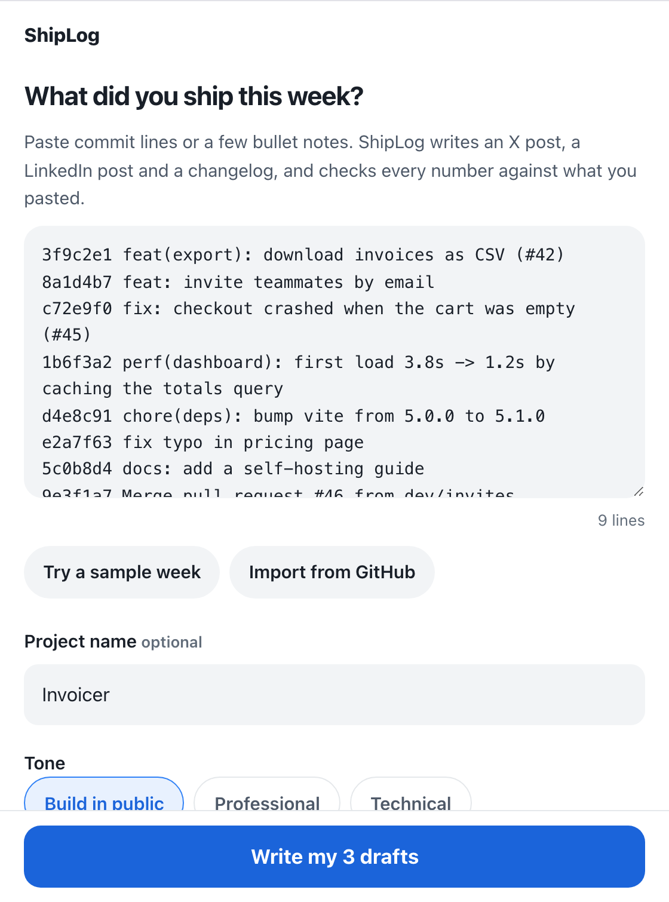

# ShipLog for Anna

Paste this week's commits. Get an X post, a LinkedIn post and a changelog, with every number checked against your log.

ShipLog is an [Anna AI OS](https://anna.partners) app for solo builders who ship every week but never find time to write about it.



## What it does

1. **Reads your notes without AI.** Every line (git log output, bullets, release notes) is sorted into features, fixes, speed-ups, releases, docs and noise. Merges, dependency bumps, typo fixes and formatting commits are skipped.
2. **Writes three drafts with Anna AI** from that digest only: an X post, a LinkedIn update and a changelog entry. Three tones (build in public, professional, technical) and 9 output languages.
3. **Checks every number.** Numbers in the drafts that appear in your notes are marked in blue. Anything else is marked in amber, and ShipLog asks the model to fix it once before showing the result. The X post is guaranteed to fit 280 characters (X's weighting: CJK and emoji count double, links count 23).
4. **Keeps a weekly log** in your Anna storage: reopen past weeks and keep a weekly streak.

Optional: import the last 7 days of commits from a public GitHub repository.

## How it is built

A bundle-only Anna App (manifest schema 2, no Executa): the UI calls the Anna host APIs directly.

| Host API | Used for |
|---|---|
| `llm.complete` | the draft call and at most one repair call per run (billed to the user's Anna credits or own key) |
| `storage.get/set/list/delete` | the user's weekly entries and preferences (Anna Persistent Storage, per user) |
| `chat.append_artifact` | a card in the chat pointing at this week's drafts |
| `window.set_title` | window title |

Code follows a clean architecture (`bundle/src/domain` ← `application` ← `adapters` ← `infrastructure`). The domain layer (parsing, digest, number check, X length) has no I/O. See [SPEC.md](SPEC.md) for the acceptance criteria.

## Develop

```bash
npm install
npm run check          # anna-app validate --strict + vitest (unit, jsdom UI, official mountBundle ACL harness)
npx anna-app dev --mock-llm fixtures/mock-llm.jsonl   # local harness with the production dispatcher
python3 scripts/qa_harness.py                          # headless QA at 320/390/560/1280, light and dark
```

## Privacy

See [PRIVACY.md](PRIVACY.md). ShipLog has no server of its own and collects no analytics.

## License

MIT
